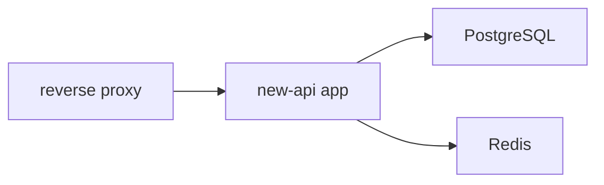

# New-API 生产部署基线

> 本文是当前仓库的生产部署单一事实来源。后续每次部署、升级、扩容、迁移前，必须先完整阅读本文，再执行任何操作。

## 1. 目标与边界

本文约束的是以下生产形态：

- 应用、PostgreSQL、Redis 分离部署
- 三者使用独立的 Docker Compose 目录
- 应用在本地编译后上传运行，不在服务器编译源码
- 旧服务器 `43.154.19.173` 只作为历史迁移来源，不再参与新生产架构
- 后续预留应用节点扩容能力，但不把数据库和 Redis 混进应用 Compose

本文不覆盖：

- 旧 MySQL 到新 PostgreSQL 的实际迁移执行细节
- Nginx / 宝塔反代的具体站点配置
- 多主机跨机房高可用设计

## 2. 当前推荐生产拓扑



当前推荐的实际落地方式：

- `new-api app`、`PostgreSQL`、`Redis` 各用一套独立 Compose
- 单机部署时，三套 Compose 先共享一个外部 Docker 网络
- 应用通过容器别名访问 `PostgreSQL` 和 `Redis`
- 后续如果应用扩到其他主机，再把应用侧连接串改为数据库 / Redis 的内网地址或专用域名

## 3. 目录标准

服务器目录建议固定为：

```text
/srv/new-api/
  app/
  postgres/
  redis/
  backups/
```

说明：

- `app/`：放应用运行目录、生产模板、`.env`、本地上传的发布产物
- `postgres/`：放 PostgreSQL Compose、`.env`、数据卷目录
- `redis/`：放 Redis Compose、`.env`、数据卷目录
- `backups/`：历史备份、迁移中间文件、人工留档资料；默认升级流程不依赖这里

如果实际目录与本文不同，后续部署文档和运维命令也必须同步修正，避免“文档写一套、服务器跑一套”。

## 4. 模板文件位置

本仓库提供的生产模板在：

- `deploy/production/app/`
- `deploy/production/postgres/`
- `deploy/production/redis/`

原则：

- 根目录 `docker-compose.yml` 是仓库默认示例，不作为当前生产单一事实来源
- 生产部署优先参考 `deploy/production/` 模板和本文
- 后续仓库升级时，要把根目录示例的变化与 `deploy/production/` 模板做人工对比

推荐使用方式：

- `app` 直接使用仓库内 `deploy/production/app/` 模板
- `postgres` 和 `redis` 复制仓库模板到各自服务器目录后运行

这样做的原因：

- 应用现在由本地构建并上传单个发布产物，服务器只负责运行
- PostgreSQL 和 Redis 作为独立基础设施，更适合放在独立目录管理

## 5. 首次初始化顺序

首次部署新服务器时，按下面顺序执行：

1. 创建外部 Docker 网络
2. 启动 PostgreSQL
3. 启动 Redis
4. 准备并迁移数据库数据
5. 启动应用
6. 做健康检查和业务验证

创建共享网络命令：

```bash
docker network create new-api-infra
```

## 6. 配置策略

### 6.1 总原则

- 生产 `.env` 只显式维护“必须稳定”和“明确需要改默认值”的参数
- 不把旧环境里所有参数机械复制到新环境
- 但这不代表以后可以不检查仓库新增参数
- 每次升级前都必须检查仓库是否新增了影响生产行为的环境变量或 Compose 参数

### 6.2 应用侧必须显式配置的参数

以下参数在当前生产架构里必须显式写入应用 `.env`：

- `SQL_DSN`
- `REDIS_CONN_STRING`
- `SESSION_SECRET`
- `CRYPTO_SECRET`
- `NODE_TYPE`
- `NODE_NAME`
- `TZ`

原因：

- `SQL_DSN` 和 `REDIS_CONN_STRING` 决定核心依赖位置
- `SESSION_SECRET` 不固定会导致重启后会话失效，多节点时更会不一致
- `CRYPTO_SECRET` 在 Redis / 多节点场景必须稳定
- `NODE_TYPE` 影响数据库迁移和定时任务执行
- `NODE_NAME` 影响多节点识别、审计日志和系统实例展示
- `TZ` 影响日志与运维排查体验

### 6.3 应用侧建议显式配置的参数

以下参数虽然代码里有默认值，但建议为当前生产行为显式固定：

- `ERROR_LOG_ENABLED=true`
- `MEMORY_CACHE_ENABLED=true`
- `BATCH_UPDATE_ENABLED=true`
- `CHANNEL_UPDATE_FREQUENCY=30`
- `STREAMING_TIMEOUT=300`
- `RELAY_TIMEOUT=0`

原因：

- 这些参数直接影响当前线上行为和运行习惯
- 仓库未来若改默认值，显式配置能减少“升级后行为悄悄变化”

### 6.4 通常可以依赖默认值的参数

除非出现明确性能或兼容性问题，以下参数可以先不写：

- `SQL_MAX_IDLE_CONNS`
- `SQL_MAX_OPEN_CONNS`
- `SQL_MAX_LIFETIME`
- `SYNC_FREQUENCY`
- `BATCH_UPDATE_INTERVAL`
- `RELAY_IDLE_CONN_TIMEOUT`
- `REDIS_POOL_SIZE`

如果后续压测、日志、数据库连接数证明需要调整，再显式补入生产 `.env`。

### 6.5 不要沿用旧环境的典型项

下面这些旧环境写法不要直接照搬：

- 指向旧服务器公网 IP 的 `SQL_DSN`
- 指向旧服务器公网 IP 的 `REDIS_CONN_STRING`
- 为了旧部署习惯而保留的外部数据库 / Redis 地址
- 未复核就直接保留的历史调试项

额外说明：

- 当前代码中，主节点设置了 `FRONTEND_BASE_URL` 时会被忽略，所以当前单体主节点部署通常不需要保留这个参数
- 若未来做前后端分离跳转节点，再单独设计该参数的使用方式

## 7. 多节点约束

后续如果扩容应用节点，遵守以下规则：

- 至少保留 1 个 `master` 节点
- 其他应用节点可以按需使用 `slave`
- 所有节点必须共享同一套：
  - `SQL_DSN`
  - `REDIS_CONN_STRING`
  - `SESSION_SECRET`
  - `CRYPTO_SECRET`
- 每个节点必须有唯一的 `NODE_NAME`

推荐策略：

- 1 个 `master` 节点负责数据库迁移和主节点任务
- 其他对外服务节点使用 `slave`，减少重复任务和启动迁移干扰

## 8. 每次部署前必须执行的检查

每次部署、升级、热修复前，必须完成下面这份检查表。

### 8.1 必读文件

必须先读：

- `docs/installation/production-deployment-baseline.md`

必要时同时读：

- `deploy/production/app/docker-compose.yml`
- `deploy/production/app/.env.example`
- `deploy/production/postgres/docker-compose.yml`
- `deploy/production/redis/docker-compose.yml`

### 8.2 仓库变化检查

先更新代码，再检查以下文件是否变动：

```bash
git diff <LAST_DEPLOY_COMMIT>..HEAD -- \
  .env.example \
  docker-compose.yml \
  Dockerfile \
  main.go \
  common/init.go \
  common/redis.go \
  model/main.go \
  router/main.go \
  README.zh_CN.md
```

再检查代码里是否新增了环境变量读取：

```bash
rg -n "os.Getenv\\(|os.LookupEnv\\(|GetEnvOrDefault\\(|GetEnvOrDefaultBool\\(|GetEnvOrDefaultString\\(" \
  main.go common model router controller service setting
```

### 8.3 新参数影响判断

发现新增参数后，按下面规则判断：

1. 如果是数据库、Redis、会话、加密、节点角色、节点标识相关参数：
   - 默认按“可能影响生产”处理
   - 需要明确评估是否补进生产 `.env`

2. 如果是定时任务、缓存、请求大小、超时、流式处理、限流相关参数：
   - 评估默认值是否改变当前行为
   - 如会改变当前行为，补进生产 `.env`

3. 如果是纯调试、监控、实验特性参数：
   - 默认不立即加入生产 `.env`
   - 只有在确实启用该能力时再配置

### 8.4 模板同步检查

每次升级都要人工比对：

- 根目录 `docker-compose.yml`
- 根目录 `.env.example`
- `deploy/production/` 下的生产模板

重点看：

- 新增环境变量
- 容器启动参数变化
- 卷挂载变化
- 健康检查变化
- 数据库默认类型、版本、依赖变化

## 9. 部署步骤

### 9.1 PostgreSQL

首次初始化：

```bash
mkdir -p /srv/new-api/postgres
cp /srv/new-api/app/deploy/production/postgres/docker-compose.yml /srv/new-api/postgres/
cp /srv/new-api/app/deploy/production/postgres/.env.example /srv/new-api/postgres/.env
cd /srv/new-api/postgres
docker compose --env-file .env up -d
```

### 9.2 Redis

首次初始化：

```bash
mkdir -p /srv/new-api/redis
cp /srv/new-api/app/deploy/production/redis/docker-compose.yml /srv/new-api/redis/
cp /srv/new-api/app/deploy/production/redis/.env.example /srv/new-api/redis/.env
cd /srv/new-api/redis
docker compose --env-file .env up -d
```

### 9.3 应用

本地构建发布产物：

```bash
powershell -File deploy/production/app/build-local-release.ps1
```

发布到服务器：

```bash
python deploy/production/app/publish-local-release.py
```

说明：

- 本地脚本会输出 `deploy/production/app/release/new-api`
- 服务器上的应用 Compose 直接挂载 `./release:/app/release:ro`
- 容器启动命令固定为 `/app/release/new-api --log-dir /app/logs`
- 当前运行时镜像为 `alpine:3.22`
- 后续升级应用时，不再依赖服务器 `git pull` 后本地构建源码
- 不要把数据库和 Redis 的生命周期耦合到应用 Compose
- 如果仓库里的 `deploy/production/postgres/` 或 `deploy/production/redis/` 模板发生变化，要手动同步到 `/srv/new-api/postgres/` 和 `/srv/new-api/redis/`

## 10. 验证清单

每次部署完成后至少验证：

1. Compose 状态

```bash
docker compose \
  --env-file deploy/production/app/.env \
  -f deploy/production/app/docker-compose.yml \
  ps
```

2. 应用健康检查

```bash
curl -fsS http://127.0.0.1:3000/api/status
```

3. 应用日志

```bash
docker compose \
  --env-file deploy/production/app/.env \
  -f deploy/production/app/docker-compose.yml \
  logs --tail=200
```

4. 数据库连通性

- 确认应用启动日志没有数据库迁移失败
- 确认能够正常登录后台、查看渠道、查看用户、查看日志

5. Redis 连通性

- 确认应用启动日志没有 Redis ping 失败
- 确认缓存相关功能没有明显报错

## 11. 回滚原则

默认升级流程不再要求每次发布前先做数据库备份。

原因：

- 应用回滚通常比数据库回滚简单
- 一旦应用新版本触发了数据库结构迁移，直接回退代码未必等于完全可回退

当前默认回滚方式：

- 重新执行本地构建并上传上一个可用版本的 `release/new-api`
- 必要时一并回退 `deploy/production/app/docker-compose.yml`
- 保持生产 `.env` 不变，除非本次变更明确修改了运行参数

额外说明：

- 如果某次发布明确涉及数据库结构迁移、危险数据修正、或不可逆脚本，再单独决定是否人工备份
- 默认不要把“先备份再部署”写成每次都执行的固定动作

## 12. 安全要求

- 不要把 PostgreSQL 和 Redis 无限制暴露到公网
- 如果未来应用扩到其他主机，优先使用内网地址、私网 DNS 或 VPN 网络
- 如果必须开放端口，只允许受信任应用节点访问
- 生产密码、密钥只保存在服务器 `.env`，不要提交到仓库

## 13. 后续执行约束

从现在开始，凡是“部署 new-api 到生产”“升级生产版本”“扩容应用节点”“调整生产环境变量”“迁移数据库”的请求，都应先阅读本文，再开始执行。
